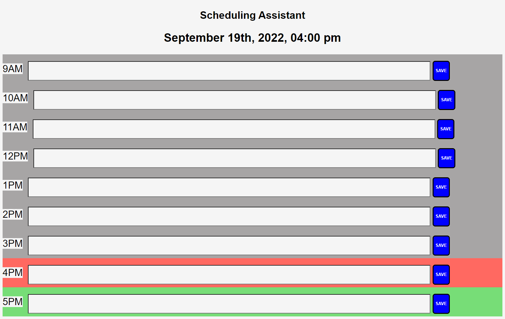

# Schedule-Assistant

Schedule_Challenge_Chris_Kang
[Link: Click here to see Schedule Challenge]("https://kjman26.github.io/Schedule-Assistant/")

Purpose: The purpose of this project is to create a daily planner that allows the user to create an efficient schedule amidst the hecticness of life.

Functionality/Instructions: The user is able to create a daily schedule with ease based on the time during traditional working hours (9a-5p). It is color coded to indicate whether the time slot is currently full, in the past, or open and indicated by red, gray, or green.

What I learned: Classes are crucial! Proper syntax is a must and the tiniest of errors will lead to failure.
I also learned that there are a multitude of ways to create this web page!

Credits: Creator: Chris Kang - Creator
W3 Schools, Google, MDN, JQuery, Instructor, TA's